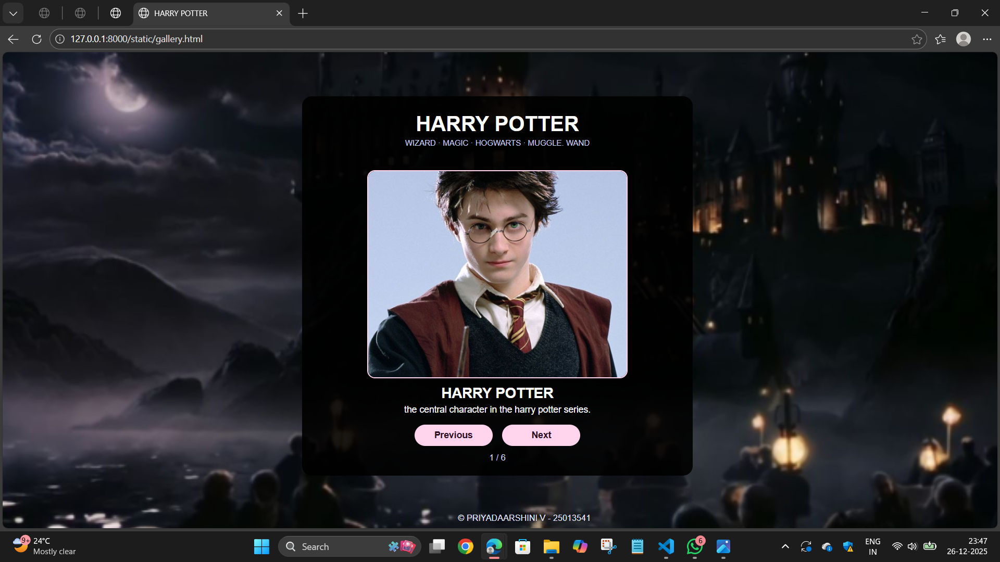
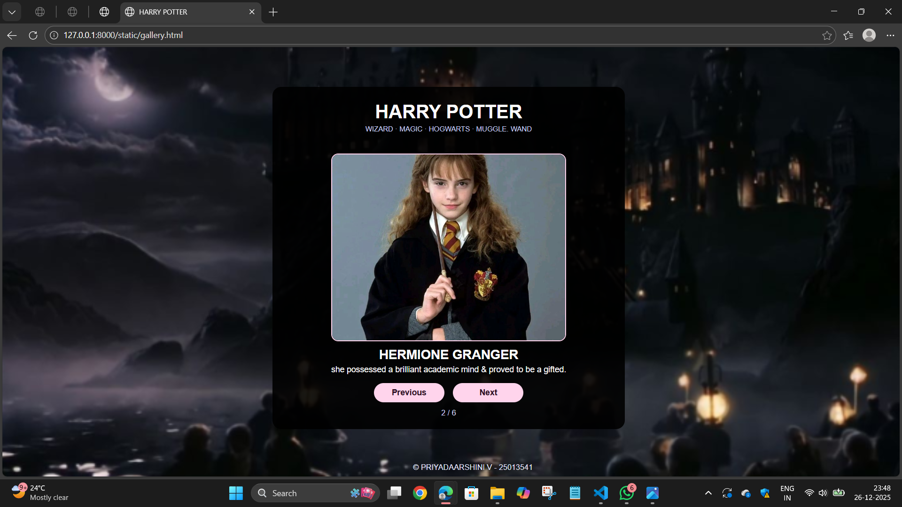
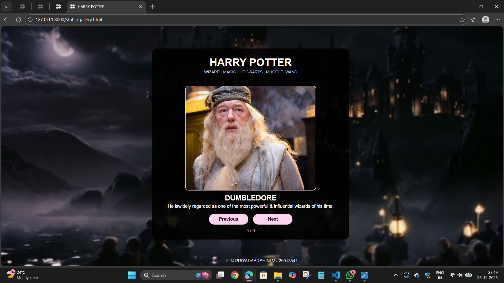
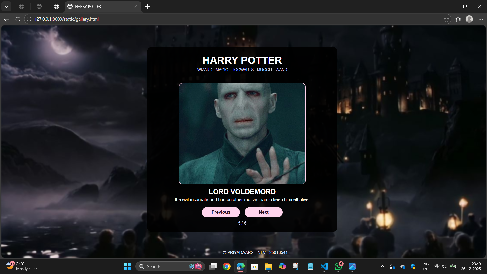
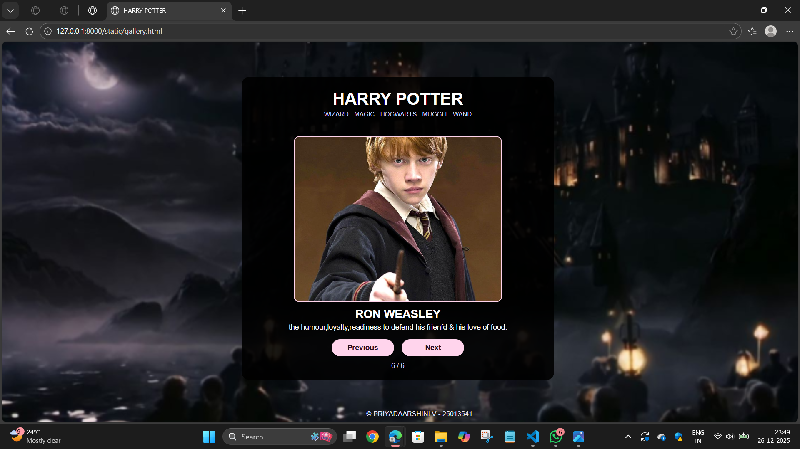

# Ex.07 Design of Interactive Image Gallery
## Date:26.12.2025

## AIM:
To design a web application for an inteactive image gallery for a minimum five images with next and previous buttons.

## DESIGN STEPS:

### Step 1:
Clone the github repository and create Django admin interface.

### Step 2:
Change settings.py file to allow request from all hosts.

### Step 3:
Use CSS for positioning and styling.

### Step 4:
Write JavaScript program for implementing interactivity.

### Step 5:
Validate the HTML and CSS code.

### Step 6:
Publish the website in the given URL.

## PROGRAM:
```
gallery.html 

<head>
    <meta charset="UTF-8">
    <title>HARRY POTTER</title>
    <link rel="stylesheet" href="gallery.css">
</head>
<body>
    <div class="box">
        <h1 class="heading">HARRY POTTER</h1>
        <p class="small-text">WIZARD · MAGIC · HOGWARTS · MUGGLE. WAND</p>

        <div class="image-area">
            

            <p class="title" id="title-text">Spiral Story</p>
            <p class="info" id="info-text">
                Harry Potter series is fundamentally a fantasy adventure story that heavily incorporates themes of magic and extraordinary, "miraculous" survival.
            </p>
        </div>

        <div class="buttons">
            <button onclick="prev()">Previous</button>
            <button onclick="next()">Next</button>
        </div>

        <p class="count" id="count-text">1 / 6</p>
    </div>

    <footer class="foot*{
    margin: 0;
    padding: 0;
    box-sizing: border-box;
}
body {
    font-family: Arial, sans-serif;
    background: url("wall.png") ;
    background-size: cover;
    min-height: 100vh;
    display: flex;
    flex-direction: column;
    justify-content: space-between;
    text-align: center;
    color: white;
}
.box {
    width: 90%;
    max-width: 600px;
    margin-left:460px;
    padding: 20px;
    background-color: rgba(0, 0, 0, 0.9);
    border-radius: 15px;
    margin-top:68px;
}
.heading {
    font-size: 32px;
    margin-bottom: 4px;
    margin-top:5px;
}
.small-text {
    font-size: 12px;
    margin-bottom: 15px;
    color: #cdd4ff;
}
.image-area img{
    margin-top:20px;
    width: 100%;
    max-width:400px;
    height: 320px;
    object-fit: cover;
    border-radius: 12px;
    border: 2px solid #ffd4ec;
}
.title {
    margin-top: 10px;
    font-size: 22px;
    font-weight: bold;
}
.info {
    margin-top: 4px;
    font-size: 14px;
}
.buttons {
    margin-top: 15px;
    display: flex;
    justify-content: center;
    gap: 15px;
}
.buttons button {
    width: 120px;
    padding: 8px;
    font-size: 14px;
    font-weight: bold;
    border-radius: 20px;
    border: none;
    cursor: pointer;
    background-color: #ffd4ec;
    color: #2b1022;
}
.count {
    margin-top: 10px;
    font-size: 13px;
    color: #cdd4ff;
}
.footer {
    margin-left:75px;
    font-size: 13px;
    padding: 8px;
    color: #e5e7ff;
}er">
        &copy; PRIYADAARSHINI V - 25013541
    </footer>

    <script src="galllery.js"></script>
</body>
</html>
```
```
gallery.css

*{
    margin: 0;
    padding: 0;
    box-sizing: border-box;
}
body {
    font-family: Arial, sans-serif;
    background: url("wall.png") ;
    background-size: cover;
    min-height: 100vh;
    display: flex;
    flex-direction: column;
    justify-content: space-between;
    text-align: center;
    color: white;
}
.box {
    width: 90%;
    max-width: 600px;
    margin-left:460px;
    padding: 20px;
    background-color: rgba(0, 0, 0, 0.9);
    border-radius: 15px;
    margin-top:68px;
}
.heading {
    font-size: 32px;
    margin-bottom: 4px;
    margin-top:5px;
}
.small-text {
    font-size: 12px;
    margin-bottom: 15px;
    color: #cdd4ff;
}
.image-area img{
    margin-top:20px;
    width: 100%;
    max-width:400px;
    height: 320px;
    object-fit: cover;
    border-radius: 12px;
    border: 2px solid #ffd4ec;
}
.title {
    margin-top: 10px;
    font-size: 22px;
    font-weight: bold;
}
.info {
    margin-top: 4px;
    font-size: 14px;
}
.buttons {
    margin-top: 15px;
    display: flex;
    justify-content: center;
    gap: 15px;
}
.buttons button {
    width: 120px;
    padding: 8px;
    font-size: 14px;
    font-weight: bold;
    border-radius: 20px;
    border: none;
    cursor: pointer;
    background-color: #ffd4ec;
    color: #2b1022;
}
.count {
    margin-top: 10px;
    font-size: 13px;
    color: #cdd4ff;
}
.footer {
    margin-left:75px;
    font-size: 13px;
    padding: 8px;
    color: #e5e7ff;
}
```
```
gallery.js

var pics = [
    {
        image: "harry.png",
        title: "HARRY POTTER",
        info: "the central character in the harry potter series."
    },
    {
        image: "Hermione.jpg",
        title: "HERMIONE GRANGER",
        info: "she possessed a brilliant academic mind & proved to be a gifted."
    },
    {
        image: "dobby.jpg",
        title: "DOBBY",
        info: "won hearts with his bravery,loyalty & unique charm ."
    },
    {
        image: "dumbledore.png",
        title: "DUMBLEDORE",
        info: "He iswidely regarded as one of the most powerful  & influential wizards of his time."
    },
    {
        image: "voldemort.jpg",
        title: "LORD VOLDEMORD",
        info: "the evil incarnate and has on other motive than to keep himself alive."
    },
    {
        image: "ron.jpg",
        title: "RON WEASLEY",
        info: "the humour,loyalty,readiness to defend his frienfd & his love of food."
    }
];

var i = 0; 

var photo     = document.getElementById("photo");
var titleText = document.getElementById("title-text");
var infoText  = document.getElementById("info-text");
var countText = document.getElementById("count-text");

function show() {
    photo.src           = pics[i].image;
    titleText.innerHTML = pics[i].title;
    infoText.innerHTML  = pics[i].info;
    countText.innerHTML = (i + 1) + " / " + pics.length;
}
function next() {
    i++;
    if (i >= pics.length) {
        i = 0;
    }
    show();
}
function prev() {
    i--;
    if (i < 0) {
        i = pics.length - 1;
    }
    show();
}
show();
```

## OUTPUT:







## RESULT:
The program for designing an interactive image gallery using HTML, CSS and JavaScript is executed successfully.
